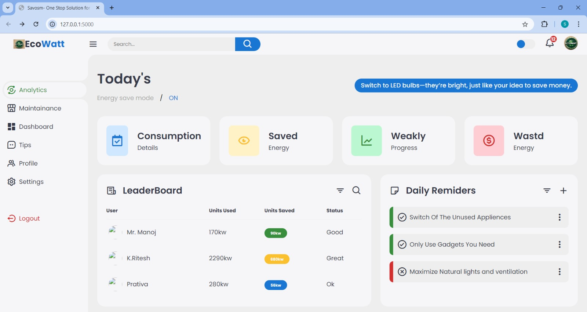
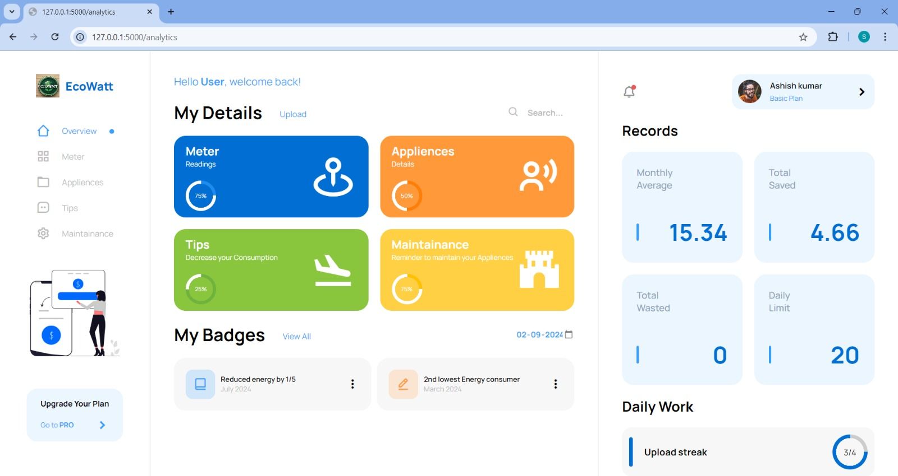

# EcoWatt: AI-Driven Energy Optimization for Cities

Welcome to the **EcoWatt** project! This repository contains the code and documentation for developing an AI-driven platform aimed at optimizing energy consumption in urban environments. By leveraging real-time data and predictive analytics, EcoWatt helps reduce energy wastage while maintaining high living standards in smart cities.
# Home page


## Table of Contents
- [Project Overview](#project-overview)
- [Key Features](#key-features)
- [Technologies Used](#technologies-used)
- [Installation](#installation)
- [Usage](#usage)
- [Contributing](#contributing)
- [License](#license)
- [Contact](#contact)

## Project Overview

EcoWatt is a software solution that uses artificial intelligence to analyze and optimize energy consumption in urban settings. The platform integrates with existing devices such as laptops, smartphones, and smart home devices to monitor energy usage, provide actionable insights, and implement optimizations to reduce waste. Our goal is to empower both residents and city administrators to make smarter, more sustainable energy choices.
# User page

### Key Components:
- **Energy Consumption Tracking**: Users can manually input their energy usage data or automatically sync data from smart devices.
- **AI-Powered Analysis**: The system uses advanced AI algorithms to detect patterns, forecast energy demand, and identify optimization opportunities.
- **Personalized Recommendations**: Based on the analysis, users receive tailored advice on how to adjust their energy usage for maximum efficiency.
- **Interactive Dashboard**: Provides a user-friendly interface to track energy consumption trends, set goals, and monitor progress.
- **Community Engagement**: Users can share tips and participate in challenges to further reduce energy consumption.

## Key Features

- **Daily Monitoring**: Continuously collects and analyzes data from sensors and IoT devices across the city.
- **Predictive Energy Management**: AI forecasts energy needs and proactively adjusts distribution to prevent wastage.
- **User Dashboard**: An intuitive interface that allows users to track their energy usage and make informed decisions.
- **Compatibility**: Integrates seamlessly with existing devices such as smart thermostats, plugs, and meters.
- **Remote Control Integration**: Users can remotely adjust device settings via their smartphone to optimize energy use on the go.

## Technologies Used

### Frontend:
- **HTML5/CSS3/JavaScript**: For building an adaptive web interface.

### Backend:
- **Python**: For server-side logic, AI algorithms, and data processing.
- **MySQL**: For managing and storing energy usage data.
- **Flask**: For building the web application framework.

### AI and Data Processing:
- **TensorFlow/PyTorch**: For implementing AI algorithms such as LSTM, ARIMA, and CNNs.
- **Scikit-learn**: For data analysis and machine learning tasks.
- **OpenCV**: For image processing tasks, including OCR for meter readings.

## Installation

To set up the EcoWatt platform locally, follow these steps:

1. **Clone the Repository:**
   ```cmd
   git clone https://github.com/yourusername/EcoWatt.git
   cd EcoWatt
   ```
2. **Create a virtual environment and Activate it**
   ```cmd
   python -m venv venv
   venv\Scripts\activate
   ```
3. **Install the Required Dependencies:**
   ``` cmd
   pip install -r requirements.txt
   ```
4. **Run the Application:**
   ```cmd
   flask run
   ```

## Usage

Once the platform is up and running, users can log in and start tracking their energy consumption. The AI-driven analytics will provide personalized recommendations based on the data collected from both manual inputs and smart device integrations. Users can also engage with the community, set energy-saving goals, and monitor their progress through the dashboard.

## Contributing

We welcome contributions to the EcoWatt project! If you're interested in contributing, please follow these steps:

1. Fork the repository.
2. Create a new branch (`git checkout -b feature-branch`).
3. Make your changes and commit them (`git commit -m 'Add some feature'`).
4. Push to the branch (`git push origin feature-branch`).
5. Create a new Pull Request.

## License

This project is licensed under the MIT License. See the [LICENSE](LICENSE) file for more details.

## Contact

For questions, feedback, or contributions, please contact us at: [ashishkumarjena1437@gmail.com](mailto:ashishkumarjena1437@gmail.com).


   


